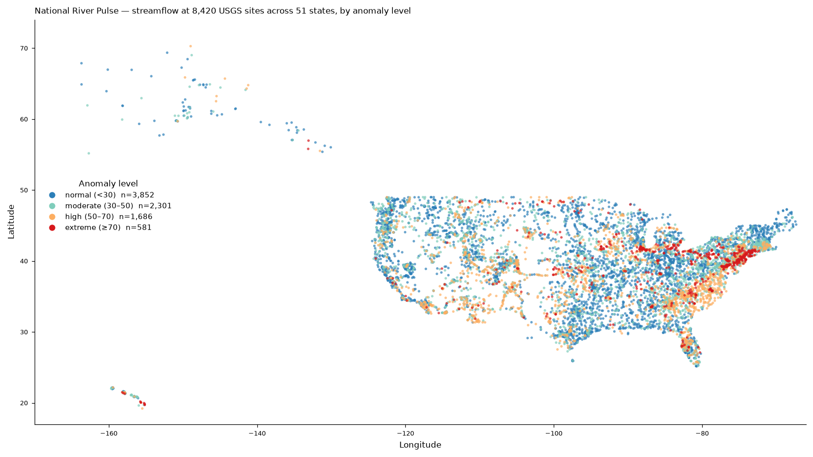
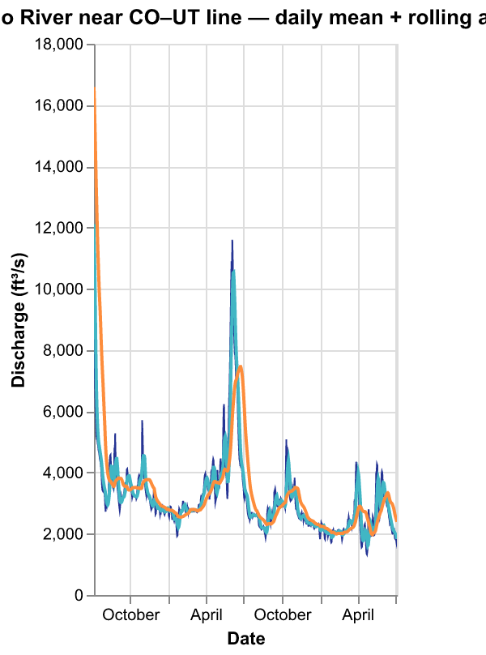
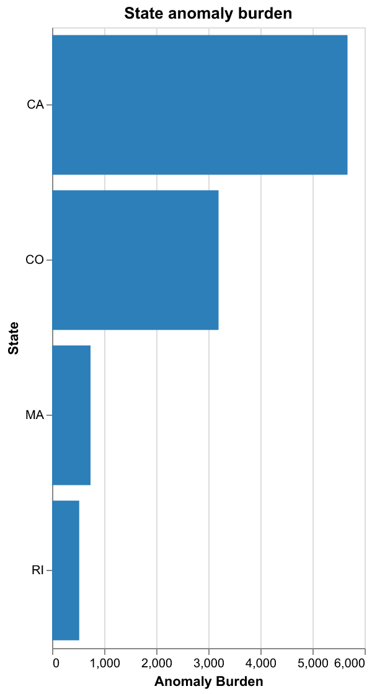
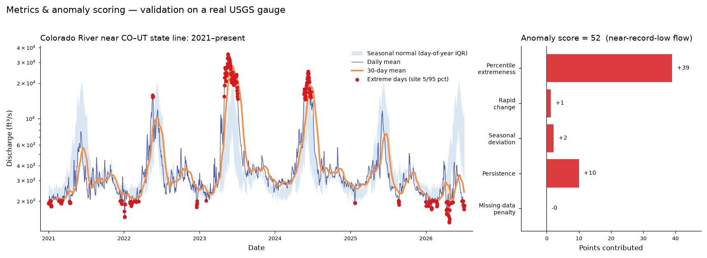

# 🌊 When Rivers Speak — A National River Observatory

> Rivers are dynamic systems, but public dashboards often show them as isolated
> gauges, static charts, or emergency-only alerts. **When Rivers Speak** turns
> USGS water data into an interactive national observatory for exploring river
> behavior across space and time.

An interactive [marimo](https://marimo.io) dashboard that fetches, processes,
stores, analyzes, and visualizes U.S. river data from the U.S. Geological
Survey. It combines historical time series, latest observations, anomaly
detection, and high-performance mapping so you can explore how rivers change
across states, seasons, and hydrologic conditions.

**This is a situational-awareness and exploratory data tool. It is _not_ a
flood-prediction system and carries no emergency reliability guarantees.**

---

## Live demo

- **App (Hugging Face Spaces):** `https://huggingface.co/spaces/rodrigosf672/when-rivers-speak`
- **Docs:** [`docs/`](docs/)

## Screenshots

| National River Pulse | Historical Explorer |
|---|---|
|  |  |

| State Comparison | Metrics & anomaly validation |
|---|---|
|  |  |

*(Static previews rendered from the bundled sample dataset. The live app maps
are interactive deck.gl layers.)*

## Why this exists

Most public river data lives behind one-gauge-at-a-time pages or emergency
alerting systems. Neither makes it easy to ask exploratory questions — *which
rivers are unusually low for this time of year? which states carry the heaviest
anomaly burden right now? where is monitoring dense, and where is it thin?* This
project brings the national picture into one fast, widget-driven view so those
questions are a click away.

## What the dashboard shows

Six tabs, all driven by shared filters (state, parameter, date range, anomaly
threshold, map layer):

1. **National River Pulse** — a U.S. map of latest river conditions colored by
   anomaly level, summary cards, and the most anomalous sites.
2. **Historical Explorer** — per-site time series with rolling 7/30-day means,
   a day-of-year seasonal-normal band, and anomaly markers.
3. **State Comparison** — anomaly burden ranking, score distributions, and a
   sortable state table.
4. **River Change Detector** — top sudden rises and drops, plus a volatility
   ranking.
5. **Data Coverage Observatory** — site counts, record longevity, and
   completeness by state and parameter.
6. **About the Data** — sources, the anomaly-score definition, update cadence,
   and limitations.

## Data sources

All data comes from the **U.S. Geological Survey (USGS) Water Services API**
(`waterservices.usgs.gov`): the Site, Daily Values, and Instantaneous Values
services. USGS water data are in the public domain. This project is independent
and not affiliated with or endorsed by the USGS.

Parameters in the bundled dataset (all nationwide, 2021–present): **discharge /
streamflow**, **gage height**, **water temperature**, **specific conductance**,
**dissolved oxygen**, and **pH**. Streamflow and gage height have the densest
coverage; the four water-quality parameters are reported at progressively fewer
gauges (water temperature at ~2,300 sites down to pH). Turbidity is registered in
the pipeline and can be added the same way.

## Architecture

```text
USGS API  ──►  normalize  ──►  partitioned Parquet  ──►  DuckDB summary tables  ──►  marimo app
 (fetch)      (tidy frames)   state/parameter/year        precomputed, fast          (small queries)
```

The app never loads national data into pandas: it issues small, filtered DuckDB
queries and gets back only what a widget selection needs. See
[`docs/architecture.md`](docs/architecture.md) and
[`docs/data_dictionary.md`](docs/data_dictionary.md).

## Quickstart

```bash
git clone https://github.com/rodrigosf672/when-rivers-speak.git
cd when-rivers-speak
pip install -e .

# The repo ships a small sample dataset. Build the database and run the app:
python scripts/build_database.py
marimo run app.py
```

Open the printed URL. The app starts in **demo mode** using the bundled sample.

## Fetching data

```bash
# Quick subset for local iteration (a few minutes):
python scripts/fetch_demo_data.py --states RI MA CO CA --params 00060 00065 --years 2
python scripts/build_database.py

# Rebuild the full national bundled dataset (all 51 states, ~30 min):
python scripts/fetch_demo_data.py \
  --states AL AK AZ AR CA CO CT DE FL GA HI ID IL IN IA KS KY LA ME MD MA MI MN MS MO \
           MT NE NV NH NJ NM NY NC ND OH OK OR PA RI SC SD TN TX UT VT VA WA WV WI WY DC \
  --params 00060 00065 --years 6
python scripts/build_database.py

# Build a deeper multi-decade dataset (full mode):
export RIVERS_DATA_MODE=full
export RIVERS_DATA_DIR=data/full
python scripts/fetch_sites_all_states.py
python scripts/fetch_daily_partitioned.py --states CA CO TX --start 2000 --end 2024
python scripts/update_latest.py --states CA CO TX
python scripts/build_database.py
```

Fetches are chunked per state / parameter / year and cached, so runs are
resumable and incremental.

## Running locally

```bash
marimo run app.py        # served, read-only app (as deployed)
marimo edit app.py       # interactive notebook editor
```

Environment variables:

| Variable            | Default        | Meaning |
|---------------------|----------------|---------|
| `RIVERS_DATA_MODE`  | `demo`         | `demo` (bundled sample) or `full` |
| `RIVERS_DATA_DIR`   | `data/sample`  | base dir holding `parquet/` and `rivers.duckdb` |
| `RIVERS_CACHE_DIR`  | `.cache`       | raw HTTP response cache |

## Deploying to Hugging Face Spaces

The repo is a ready-to-deploy **Docker Space**.

1. Create a new Space (SDK: **Docker**).
2. Push this repo to it (the YAML front matter at the top of this README
   configures the Space; `app_port: 7860` matches the `Dockerfile`).

   ```bash
   git remote add space https://huggingface.co/spaces/rodrigosf672/when-rivers-speak
   git push space main
   ```
3. The Space builds the image, builds the DuckDB from the bundled sample, and
   serves the app on port 7860.

Optional: the [`deploy-notes.yml`](.github/workflows/deploy-notes.yml) workflow
mirrors the repo to the Space on every push to `main` when you set an `HF_TOKEN`
secret and an `HF_SPACE` variable. See [`docs/deployment.md`](docs/deployment.md).

## Limitations

- **Not a flood-prediction system.** No forecasting, no emergency reliability.
- USGS values are **provisional** until reviewed and may be revised.
- Coverage varies widely by state, parameter, and era; gaps are common.
- The anomaly score is a **heuristic** for exploration, not a calibrated alert.
- The bundled dataset covers all 50 states + DC (~26,000 sites, six parameters,
  2021–present); deeper multi-decade history is available via full mode.

## Roadmap

See [`docs/roadmap.md`](docs/roadmap.md). Highlights: more parameters lit up in
the UI, a river-network layer, Hugging Face Datasets for larger stores, and an
optional static WASM demo on GitHub Pages.

## Citation / acknowledgement

Data courtesy of the **U.S. Geological Survey**, National Water Information
System (NWIS), retrieved via USGS Water Services. If you use this project,
please cite USGS as the data source and link back to this repository.

## License

MIT — see [`LICENSE`](LICENSE). USGS data are in the public domain.
