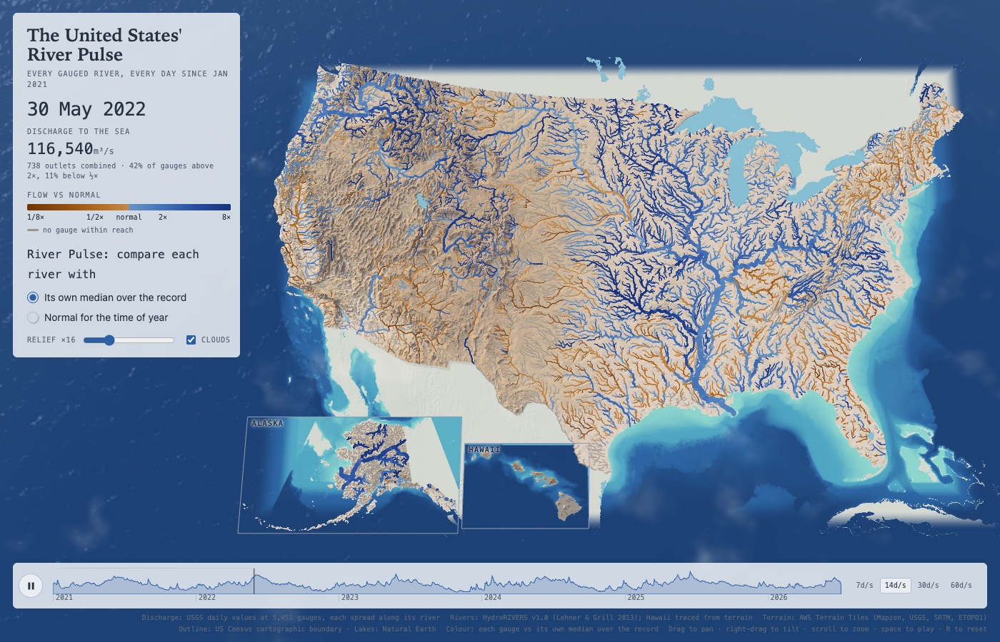
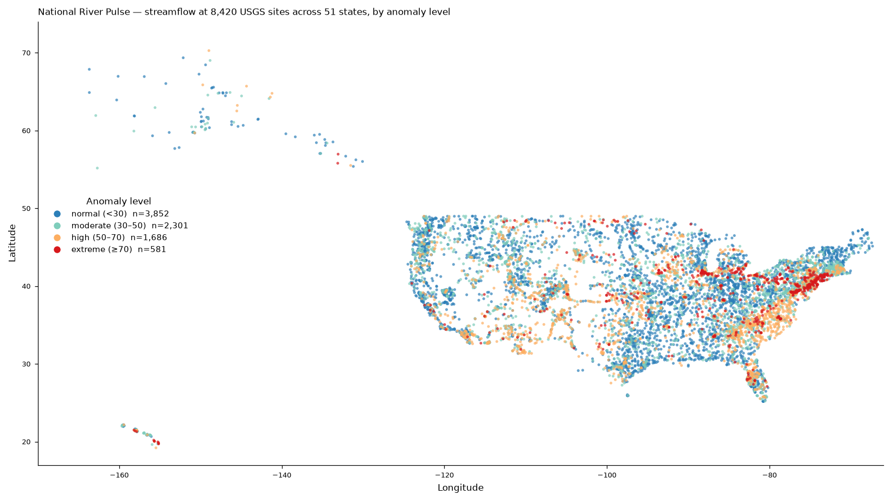
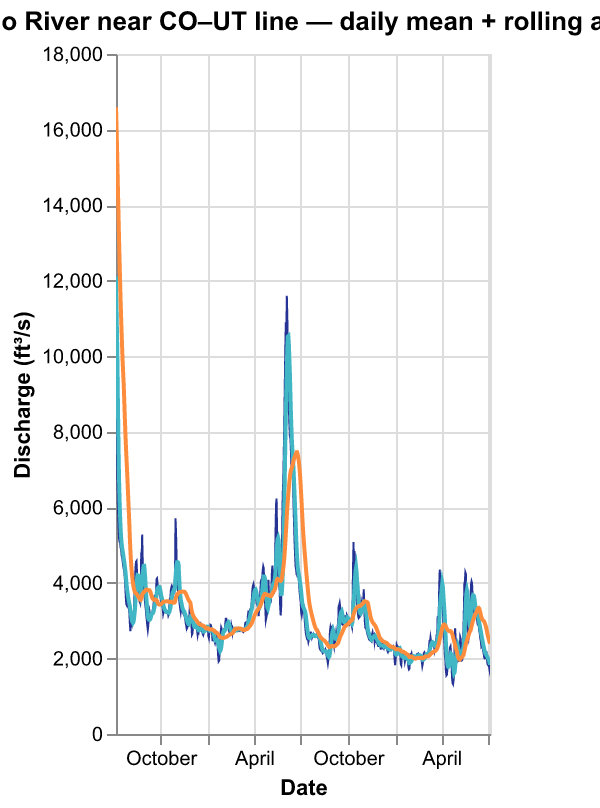
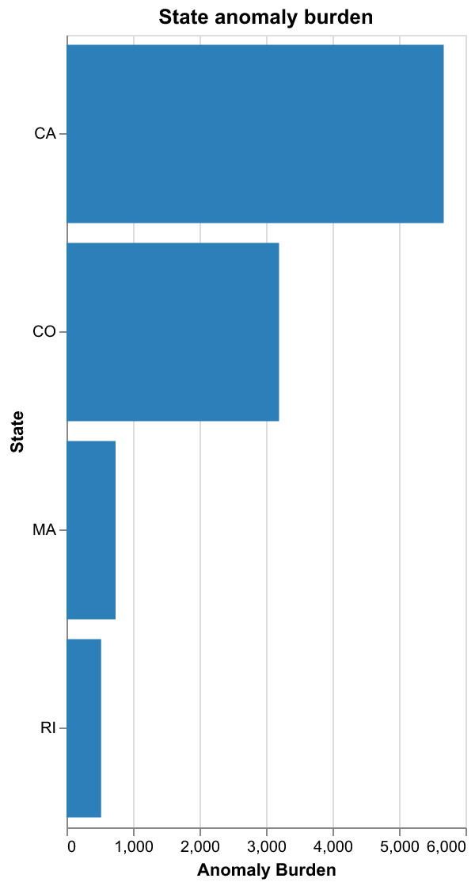
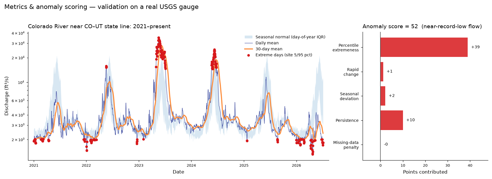

# 🌊 When Rivers Speak: A National River Observatory

> Rivers are dynamic systems, but public dashboards often show them as isolated
> gauges, static charts, or emergency-only alerts. **When Rivers Speak** turns
> USGS water data into an interactive national observatory for exploring river
> behavior across space and time.

**Try it live:**

- 🗺️ **[River Pulse map](https://rodrigosf672-when-rivers-speak.hf.space/pulse/)**: every gauged river in the U.S., animated day by day since 2021
- 📊 **[Dashboard](https://rodrigosf672-when-rivers-speak.hf.space/)**: filter, compare, and dig into ~26,000 USGS monitoring sites
- 🤗 [Hugging Face Space](https://huggingface.co/spaces/rodrigosf672/when-rivers-speak) · 📚 [Docs](docs/)
- 🎤 [PyBay 2026 talk: Building Scientific Observatories](docs/talks/pybay-2026-building-scientific-observatories.html) (slides, download and open in a browser)

[](https://rodrigosf672-when-rivers-speak.hf.space/pulse/)

Built with [marimo](https://marimo.io), DuckDB, and Parquet. One notebook
(`app.py`) serves two views: an analytical dashboard and an animated 3D map.

> **This is a situational-awareness and exploratory data tool. It is _not_ a
> flood-prediction system and carries no emergency reliability guarantees.**

---

## Why this exists

Most public river data lives behind one-gauge-at-a-time pages or emergency
alerting systems. Neither makes it easy to ask exploratory questions: *which
rivers are unusually low for this time of year? which states carry the heaviest
anomaly burden right now? where is monitoring dense, and where is it thin?* This
project brings the national picture into one fast, widget-driven view so those
questions are a click away.

## Two ways to explore

### River Pulse map (`/pulse/`)

A three.js map of the lower 48, Alaska, and Hawaii, with every river coloured
by how its flow compares with normal, from ⅛× (brown) to 8× (blue). Press play
to watch six years of droughts and floods move across the country.

- **Two baselines:** compare each river with its own median over the record,
  or with what is normal for that time of year.
- **Discharge to the sea:** a running national total across every U.S.
  river outlet to the sea, with the share of gauges running high or low each
  day.
- **Controls:** space to play or pause, drag the timeline to jump to a date,
  drag to pan, right-drag to tilt, scroll to zoom, `R` to reset.

Rivers between gauges take the colour of the closest gauge along the river
network, preferring rivers of similar size, up to about 600 km away. The map
shows the overall pattern, not a measurement on every reach.

### Dashboard (`/`)

Six sections driven by shared filters (states, parameter, map layer, minimum
anomaly score):

1. **National River Pulse:** a U.S. map of latest conditions coloured by
   anomaly level, summary cards, and the most anomalous sites.
2. **Historical Explorer:** per-site time series with rolling 7/30-day means,
   a day-of-year seasonal-normal band, and anomaly markers.
3. **State Comparison:** anomaly burden ranking, score distributions, and a
   sortable state table.
4. **River Change Detector:** top sudden rises and drops, plus a volatility
   ranking.
5. **Data Coverage Observatory:** site counts, record longevity, and
   completeness by state and parameter.
6. **About the Data:** sources, the anomaly-score definition, update cadence,
   and limitations.

| National River Pulse | Historical Explorer |
|---|---|
|  |  |

| State Comparison | Metrics & anomaly validation |
|---|---|
|  |  |

*(Static previews rendered from the bundled sample dataset. The live maps are
interactive deck.gl layers.)*

## Quickstart

```bash
git clone https://github.com/rodrigosf672/when-rivers-speak.git
cd when-rivers-speak
pip install -e .

python scripts/build_database.py   # build DuckDB from the bundled sample
python scripts/build_pulse_assets.py   # optional: prebuild the map layers
marimo run app.py
```

Open the printed URL for the dashboard, and add `/pulse/` for the map. The app
starts in **demo mode** with the bundled sample (all 50 states + DC, six
parameters, 2021 to present).

The first time the map runs it downloads about 110 MB of public geography into
`.cache/pulse/` and derives the map layers (about 30 seconds on a laptop). The
prebuild step above does this ahead of time; otherwise the app does it on
first load. Later runs reuse the layers.

To edit the notebook instead of serving it, use `marimo edit app.py`.

## Data sources

**River data:** the **U.S. Geological Survey (USGS) Water Services API**
(`waterservices.usgs.gov`): the Site, Daily Values, and Instantaneous Values
services. USGS water data are in the public domain. This project is independent
and not affiliated with or endorsed by the USGS.

Parameters in the bundled dataset (all nationwide, 2021 to present):
**discharge / streamflow**, **gage height**, **water temperature**, **specific
conductance**, **dissolved oxygen**, and **pH**. Streamflow and gage height have
the densest coverage; the four water-quality parameters are reported at
progressively fewer gauges (water temperature at ~2,300 sites, pH at the
fewest). Turbidity is registered in the pipeline and can be added the same way.

**Map geography** (River Pulse only, downloaded on first run):

- River network: [HydroRIVERS v1.0](https://www.hydrosheds.org/products/hydrorivers)
  (Lehner & Grill 2013), North America and Arctic. Hawaii's streams are traced
  from terrain.
- Terrain: [AWS Terrain Tiles](https://registry.opendata.aws/terrain-tiles/)
  (Mapzen, USGS, SRTM, ETOPO1).
- U.S. outline: Census cartographic boundary files. Lakes: Natural Earth.

## Architecture

```text
USGS API  ──►  normalize  ──►  partitioned Parquet  ──►  DuckDB summary tables  ──►  marimo app
 (fetch)      (tidy frames)   state/parameter/year        precomputed, fast          (small queries)
```

The app never loads national data into pandas: it issues small, filtered DuckDB
queries and gets back only what a widget selection needs. See
[`docs/architecture.md`](docs/architecture.md) and
[`docs/data_dictionary.md`](docs/data_dictionary.md).

### How the two views fit together

Both views run on the same notebook through
[marimo-studio](https://marimo-team.github.io/marimo-studio/):

| URL | View | Source |
|---|---|---|
| `/` | `original`: the dashboard, every displayed cell in order | `studio/original/` |
| `/pulse/` | `pulse`: the 3D map (Svelte + three.js) | `studio/pulse/` |

The map reads a small "River Pulse" section at the end of `app.py`, whose data
prep lives in `rivers/pulse/`: terrain, the HydroRIVERS network, gauges snapped
to nearby river reaches, and daily flow codes for the last six calendar years.
The derived layers go to `$RIVERS_DATA_DIR/pulse/` (gitignored). Rebuild them
with `python scripts/build_pulse_assets.py --force`.

Notes for contributors:

- marimo-studio requires **marimo 0.25.0 exactly**, so both are pinned in
  `pyproject.toml`.
- Svelte views are built with the Deno that ships with `marimo-studio[deno]`.
- [`studio/pulse/AGENTS.md`](studio/pulse/AGENTS.md) documents how data travels
  from the notebook to the map.

## Fetching more data

```bash
# Quick subset for local iteration (a few minutes):
python scripts/fetch_demo_data.py --states RI MA CO CA --params 00060 00065 --years 2
python scripts/build_database.py

# Rebuild the full national bundled dataset (all 51 states, ~30 min):
python scripts/fetch_demo_data.py \
  --states AL AK AZ AR CA CO CT DE FL GA HI ID IL IN IA KS KY LA ME MD MA MI MN MS MO \
           MT NE NV NH NJ NM NY NC ND OH OK OR PA RI SC SD TN TX UT VT VA WA WV WI WY DC \
  --params 00060 00065 --years 6
python scripts/build_database.py

# Build a deeper multi-decade dataset (full mode):
export RIVERS_DATA_MODE=full
export RIVERS_DATA_DIR=data/full
python scripts/fetch_sites_all_states.py
python scripts/fetch_daily_partitioned.py --states CA CO TX --start 2000 --end 2024
python scripts/update_latest.py --states CA CO TX
python scripts/build_database.py
```

Fetches are chunked per state / parameter / year and cached, so runs are
resumable and incremental.

Environment variables:

| Variable            | Default        | Meaning |
|---------------------|----------------|---------|
| `RIVERS_DATA_MODE`  | `demo`         | `demo` (bundled sample) or `full` |
| `RIVERS_DATA_DIR`   | `data/sample`  | base dir holding `parquet/`, `rivers.duckdb`, and the map layers |
| `RIVERS_CACHE_DIR`  | `.cache`       | raw HTTP response cache, including the map's geography downloads |

## Deploying to Hugging Face Spaces

The repo is a ready-to-deploy **Docker Space**: the YAML front matter at the
top of this README configures it, and the `Dockerfile` serves the app on port
7860. While building the image, it:

- builds the DuckDB from the bundled sample,
- prebuilds the River Pulse map layers and both Studio views, so visitors never
  wait for them,
- switches to user 1000, which Hugging Face uses to run the container.

**Automatic deploys:** the [`deploy-notes.yml`](.github/workflows/deploy-notes.yml)
workflow uploads the repo to the Space on every push to `main`. Set it up once:

```bash
gh secret set HF_TOKEN            # a Hugging Face token with write access to the Space
gh variable set HF_SPACE -b rodrigosf672/when-rivers-speak
```

Without those two settings the workflow skips the deploy. To deploy by hand,
run the same upload the workflow does:

```python
from huggingface_hub import HfApi

HfApi().upload_folder(
    folder_path=".",
    repo_id="rodrigosf672/when-rivers-speak",
    repo_type="space",
    ignore_patterns=[".git*", "data/full/*", "*.duckdb", ".cache/*"],
)
```

See [`docs/deployment.md`](docs/deployment.md) for more.

## Limitations

- **Not a flood-prediction system.** No forecasting, no emergency reliability.
- USGS values are **provisional** until reviewed and may be revised.
- Coverage varies widely by state, parameter, and era; gaps are common.
- The anomaly score is a **heuristic** for exploration, not a calibrated alert.
- On the River Pulse map, most river reaches are coloured by a nearby gauge,
  not measured directly.
- The bundled dataset covers all 50 states + DC (~26,000 sites, six parameters,
  2021 to present); deeper multi-decade history is available via full mode.

## Roadmap

See [`docs/roadmap.md`](docs/roadmap.md). Highlights: more parameters lit up in
the UI, Hugging Face Datasets for larger stores, and an optional static WASM
demo on GitHub Pages.

## Credits

- River data courtesy of the **U.S. Geological Survey**, National Water
  Information System (NWIS), retrieved via USGS Water Services. If you use this
  project, please cite USGS as the data source and link back to this repository.
- The River Pulse map was contributed by
  [Konstantin Taletskiy](https://github.com/ktaletsk) in
  [#1](https://github.com/rodrigosf672/when-rivers-speak/pull/1).
- Map geography: HydroRIVERS (Lehner, B., Grill G. 2013, *Hydrological
  Processes* 27(15)), AWS Terrain Tiles, U.S. Census Bureau, and Natural Earth.

## License

MIT, see [`LICENSE`](LICENSE). USGS data are in the public domain. The map's
geography sources keep their own terms.
